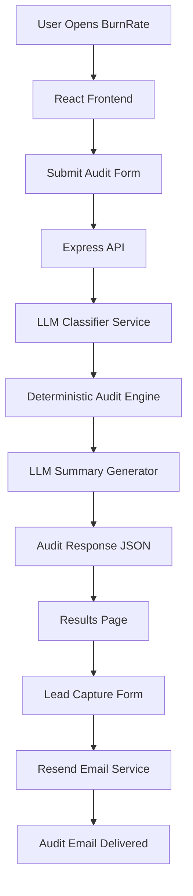

# Architecture

## System Diagram



---

# Data Flow

The BurnRate audit pipeline is intentionally split into deterministic and non-deterministic layers.

This separation exists because financial recommendations should not rely entirely on LLM reasoning.

---

## Step 1 — User Input

The frontend collects:

* tools being used
* plan type
* seats
* monthly spend
* free-text workflow description

Example:

```txt id="jlwm51"
“We use AI daily for coding, debugging, documentation, and internal workflows.”
```

The frontend sends this payload to:

```txt id="jlwm84"
/api/audit
```

---

## Step 2 — Workflow Classification

The backend first calls:

```txt id="4yjlwm"
classifier.service.js
```

using:

```txt id="jlwm82"
Groq + llama-3.1-8b-instant
```

The classifier determines:

* primary use case
* required capability level
* reasoning

Example output:

```json id="jlwm25"
{
  "useCase": "coding",
  "requiredLevel": 3
}
```

This stage uses AI because semantic understanding of workflow descriptions is difficult to encode with simple keyword rules.

---

## Step 3 — Deterministic Audit Engine

The classification result is passed into:

```txt id="7qjlwm"
auditEngine.service.js
```

This engine contains fully deterministic business logic.

Rules include:

* seat waste detection
* downgrade opportunities
* wrong-tool recommendations

Pricing data comes from:

```txt id="jlwm18"
TOOLS_DATA
```

No LLM participates in pricing calculations.

This guarantees:

* reproducibility
* predictable outputs
* testability
* no hallucinated savings estimates

---

## Step 4 — AI Summary Generation

After the calculations are complete, the audit result is passed into:

```txt id="wjlwm9"
summarizer.service.js
```

The LLM generates:

* a short personalized explanation
* biggest savings opportunity
* action recommendations

This layer is cosmetic rather than computational.

If the model fails, the system falls back to:

* deterministic templated summaries

---

## Step 5 — Results + Email Delivery

The frontend displays:

* total savings
* tool-by-tool recommendations
* classification reasoning
* AI summary

Users can optionally submit an email address.

The backend then:

* generates branded HTML
* sends audit results through Resend

---

# Why I Chose This Stack

## React + Vite

I chose React + Vite because:

* fastest iteration speed
* lightweight setup
* excellent DX
* no unnecessary abstraction

I intentionally avoided Next.js.

While Next.js is a stronger long-term production framework, the assignment timeline plus university exams meant optimization for execution speed mattered more than framework complexity.

---

## Express

Express was chosen because:

* minimal overhead
* fast to prototype
* easy middleware ecosystem
* straightforward API routing

The backend requirements were simple enough that heavier frameworks were unnecessary.

---

## Groq

Groq was selected after trying:

* OpenRouter
* Gemini API
* Anthropic API

Groq was:

* fastest
* most reliable
* free-tier friendly
* stable in India

The low latency also made the audit experience feel significantly better.

---

## Resend

Resend provided:

* fast setup
* excellent DX
* clean email API
* reliable transactional delivery

For an MVP, it was significantly simpler than configuring raw SMTP providers.

---

# What I Would Change for 10k Audits/Day

The current architecture is optimized for speed of development, not scale.

At 10k audits/day, I would change several things.

---

## 1. Add Persistent Storage

Current MVP:

```txt id="wljlwm"
stateless only
```

Production version:

* PostgreSQL or Supabase
* audit persistence
* analytics
* lead tracking
* historical reporting

---

## 2. Queue AI Tasks

Currently:

* classification and summarization run synchronously

At scale:

* move AI tasks into background queues
* use BullMQ / Redis
* asynchronous processing

This would:

* reduce request latency
* improve reliability
* prevent API bottlenecks

---

## 3. Add Caching

Many workflows produce similar classifications.

I would cache:

* common prompts
* common classifications
* pricing lookups

to reduce inference costs.

---

## 4. Split Services

Currently:

```txt id="jlwm61"
single Express service
```

At larger scale:

* audit engine service
* AI service
* email worker
* analytics pipeline

would become independent services.

---

## 5. Better Analytics + Observability

Would add:

* PostHog
* Sentry
* structured logging
* queue monitoring
* latency tracking

especially around:

* LLM failures
* API latency
* conversion funnels

---

# Final Architecture Philosophy

The most important architectural decision was:

```txt id="4jlwm8"
LLMs assist the audit.
They do not control the audit.
```

AI is used for:

* interpretation
* summarization
* user experience

Deterministic systems are used for:

* money
* pricing
* calculations
* recommendations

That separation keeps the product:

* reliable
* testable
* explainable
* cheaper to operate