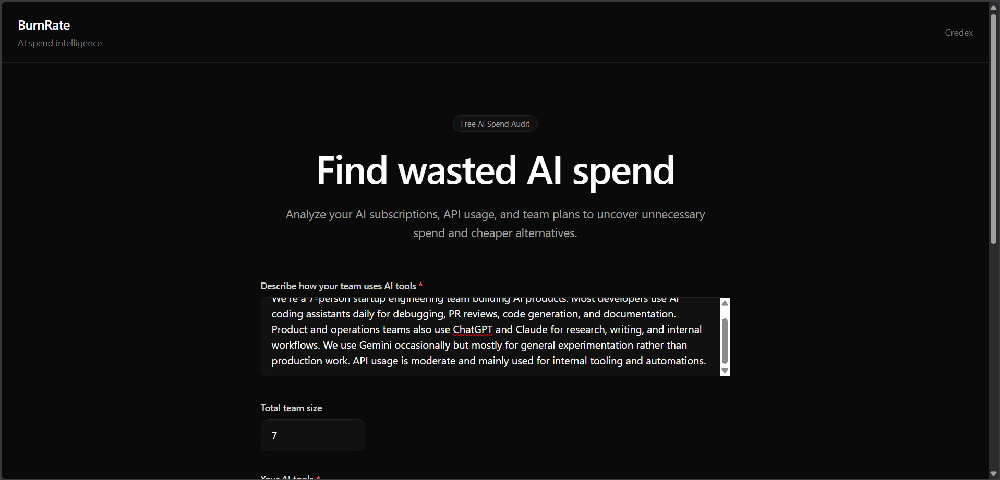
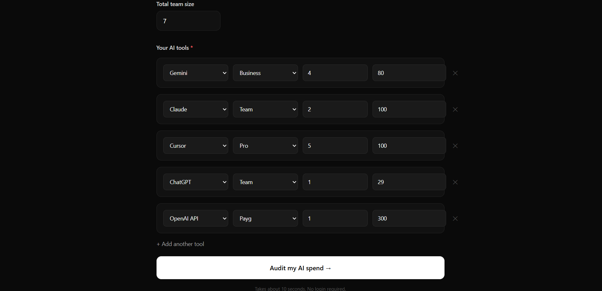
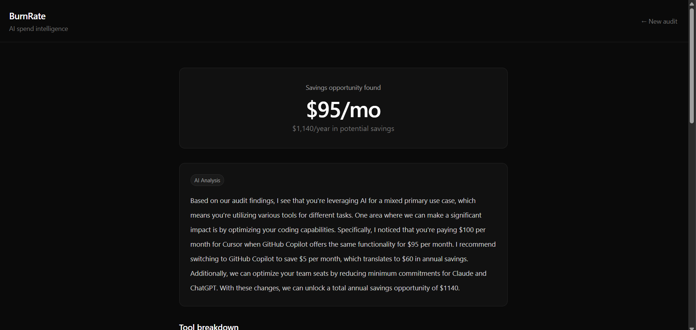
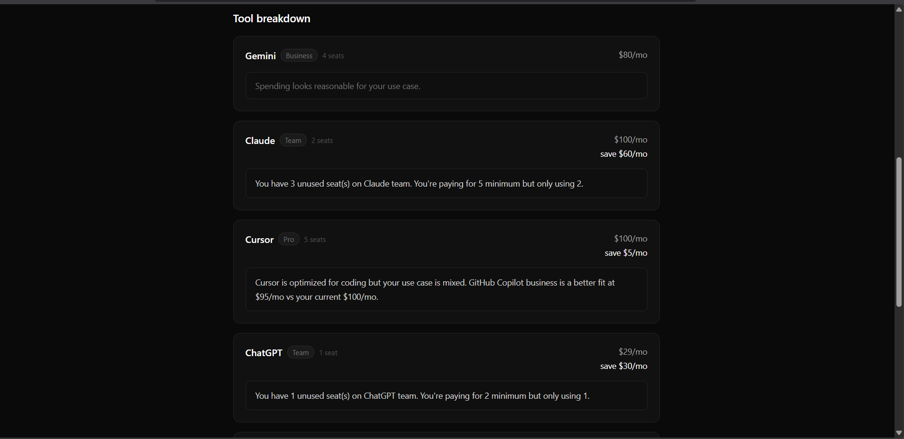
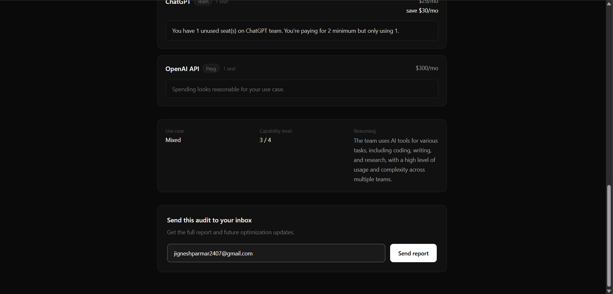
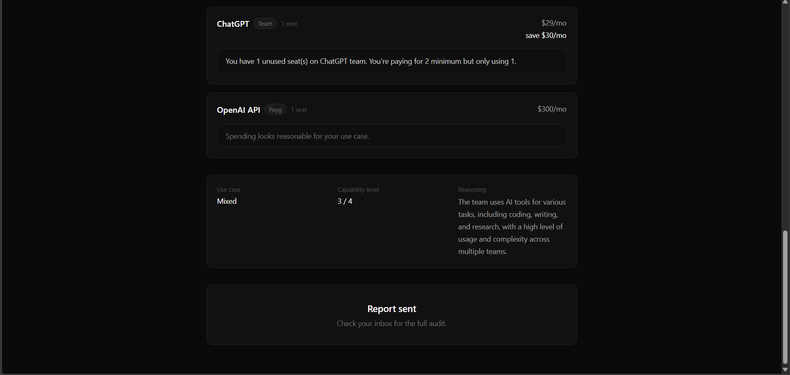
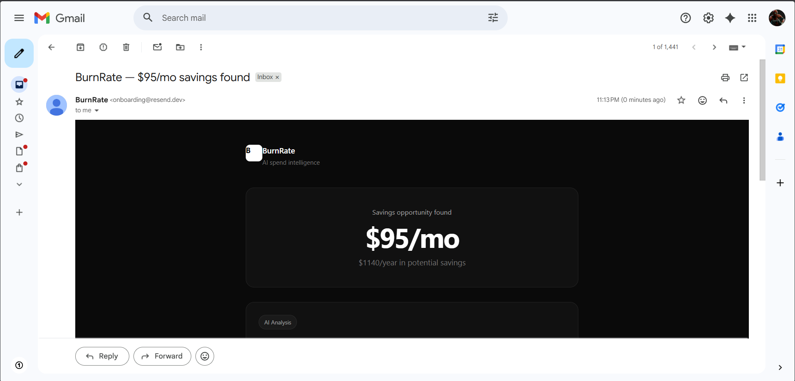
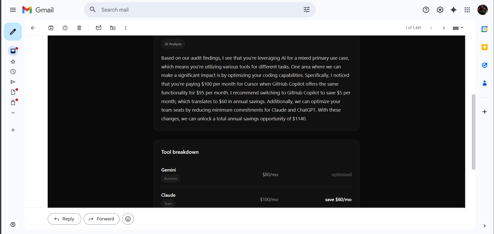

# BurnRate

AI spend intelligence for startups and engineering teams.

BurnRate analyzes AI subscriptions, API usage, and team plans to uncover wasted spend, unnecessary upgrades, seat waste, and cheaper alternatives.

Built for the Credex Product Engineer Internship Assignment.

---

# Features

- AI workflow classification
- Deterministic audit engine
- Plan downgrade detection
- Seat waste detection
- Wrong-tool recommendations
- AI-generated audit summaries
- Email report delivery
- Automated tests
- GitHub Actions CI

---

# Tech Stack

- Frontend
  - React
  - Vite
  - TailwindCSS

- Backend
  - Node.js
  - Express

- AI
  - Groq API

- Email
  - Resend

- Testing
  - Vitest

---

# Screenshots

## Landing Page



---

## Audit Input



---

## Results



---

## Breakdown



---

## Email Capture




---

## Email Report




---

# Local Setup

## Frontend

```bash
cd client
npm install
npm run dev
```

## Backend

```bash
cd server
npm install
npm run dev
```

Create `.env` inside `/server`

```env
PORT=5000
GROQ_API_KEY=your_key
RESEND_API_KEY=your_key
```

---

# Tests

```bash
cd server
npm test
```

---

# CI/CD

GitHub Actions automatically runs tests on pushes to `main`.

Workflow:

```txt
.github/workflows/ci.yml
```

---

# Documentation

Additional project documentation:

* `ARCHITECTURE.md`
* `DEVLOG.md`
* `ECONOMICS.md`
* `GTM.md`
* `LANDING_COPY.md`
* `METRICS.md`
* `PRICING_DATA.md`
* `PROMPTS.md`
* `REFLECTION.md`
* `TESTS.md`
* `USER_INTERVIEWS.md`

---

# Known Limitations

Due to assignment time constraints:

* no persistent database yet
* shareable audit URLs are placeholder-only
* benchmark mode not implemented

Priority was placed on:

* working product flow
* deterministic audit quality
* frontend polish
* testing
* deployment readiness

---

# Author

Built by Jignesh Parmar for the Credex Product Engineer Internship Assignment.

